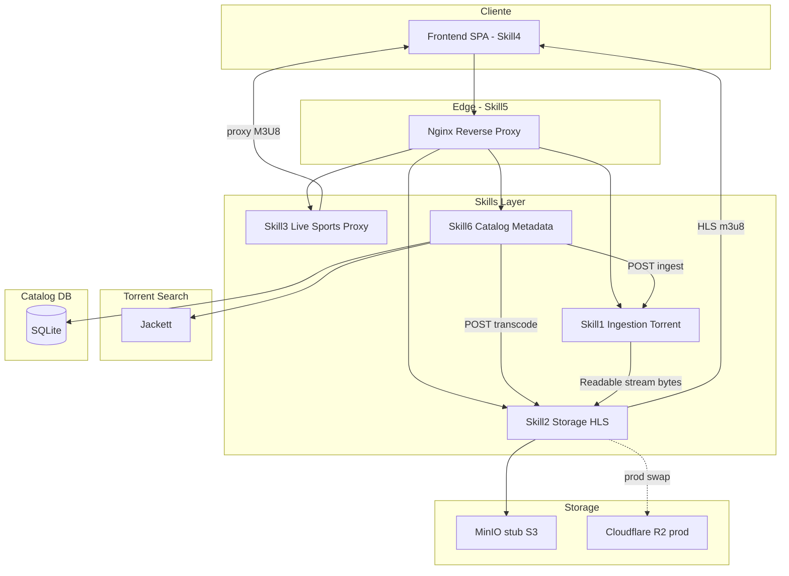
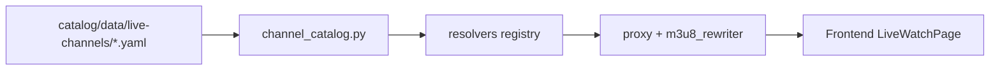
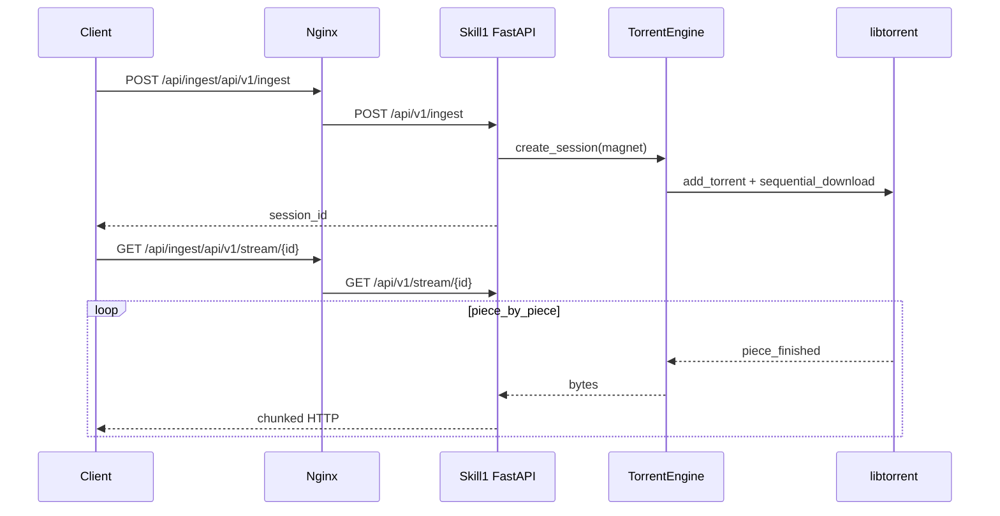

# Arquitectura Global — Streaming Platform MVP

Plataforma de streaming modular basada en **Skills** (microservicios autocontenidos). Cada Skill expone una API limpia, manejo de errores extremos y telemetría básica.

## Visión general



## Principios de diseño

1. **Skills independientes** — cada módulo vive en `skills/<nombre>/` con su propio `Dockerfile`, `SKILL.md` y dependencias.
2. **Contratos API versionados** — prefijo `/api/v1/`; cambios breaking requieren nueva versión.
3. **Trazabilidad** — reporte técnico en `docs/CHANGELOG.md` antes de cada bloque de código significativo.
4. **Telemetría uniforme** — `/health` y `/metrics` (Prometheus) en todos los Skills.
5. **Errores tipados** — jerarquía en `shared/python/errors.py`, mapeo HTTP por Skill.

## Mapa de Skills

| Skill | Directorio | Puerto | Estado |
|-------|------------|--------|--------|
| #1 Ingestión Torrent | `skills/ingestion-torrent/` | 8001 | **Fase 1** |
| #2 Storage & HLS | `skills/storage-hls/` | 8002 | **Fase 2** |
| #3 Live Sports | `skills/live-sports/` | 8003 | **Fase 3** |
| #4 Frontend View | `skills/frontend-view/` | 80 (interno) | **Fase 4** |
| #5 DevOps / Nginx | `deploy/` | 80 | **Completo** |
| #6 Catalog Metadata | `skills/catalog-metadata/` | 8004 | **Completo** |

## Contratos API

### Nginx (Skill #5) — Rutas públicas

| Ruta pública | Backend | Skill |
|--------------|---------|-------|
| `/api/ingest/*` | `ingestion-torrent:8001` | #1 |
| `/api/hls/*` | `storage-hls:8002` | #2 |
| `/api/live/*` | `live-sports:8003` | #3 |
| `/api/catalog/*` | `catalog-metadata:8004` | #6 |
| `/` | `frontend-view:80` | #4 |

### Skill #1 — Ingestión Torrent

```
POST /api/v1/ingest
  Body: { "magnet_uri": "magnet:?xt=..." }
  Response: { "session_id": "uuid", "name": "...", "size_bytes": N }

GET /api/v1/stream/{session_id}
  Response: chunked video/* (206 Partial Content soportado)

GET /api/v1/status/{session_id}
  Response: { "progress": 0.42, "download_rate_bps": N, "state": "downloading" }

DELETE /api/v1/sessions/{session_id}
  Response: 204 — libera recursos

GET /health
GET /metrics
```

### Skill #2 — Storage & HLS

```
POST /api/v1/transcode
  Body: { "session_id": "...", "source_url": "http://ingestion:8001/api/v1/stream/..." }
  Response: { "job_id": "uuid", "state": "pending", "manifest_url": "..." }

GET /api/v1/status/{job_id}
  Response: { "state": "ready", "segments_count": N, ... }

GET /api/v1/manifest/{job_id}
  Response: application/vnd.apple.mpegurl (URLs proxy)

GET /api/v1/segments/{job_id}/{segment}.ts
  Response: video/mp2t desde S3
```

### Skill #3 — Live Sports

```
GET /api/v1/channels?country=ES&tag=autonomic
  Response: catálogo filtrado (~150 canales europeos en YAML)

GET /api/v1/channels/{id}/stream
  Response: { manifest_url, proxied_url, requirements }

GET /api/v1/proxy?url=<encoded_m3u8_url>&channel_id=<id>
  Response: M3U8 reescrito con URIs proxy (+ proxy_headers del canal)

GET /api/v1/fetch?url=<encoded_segment_url>&channel_id=<id>
  Response: segmento .ts o sub-playlist con CORS *
```

Flujo catálogo → reproducción:



Catálogo generado por `deploy/scripts/sync-european-channels.py`. Resolvers: `static`, `rtve`, `brightcove`, `ccma`, scrape por emisora. Canales sin HLS fiable se omiten del YAML (`enabled: false` en script).

### Skill #6 — Catalog Metadata

```
POST /api/v1/import
  Body: { "source": "seed" }
  Response: { "inserted": N, "skipped_duplicates": N }

GET /api/v1/catalog?type=series&origin=american&cocteleria=1&status=ready
  Response: lista paginada con filtros

GET /api/v1/catalog/{id}
POST /api/v1/catalog/{id}/magnet
  Body: { "magnet_uri": "..." }

POST /api/v1/resolve-magnets
  Body: { "priority_only": true, "limit": 42 }

POST /api/v1/batch-ingest
  Body: { "priority_only": true, "limit": 5, "concurrency": 2 }

GET /api/v1/stats
GET /health
GET /metrics
```

## Flujo de ingesta (Fase 1)



## Almacenamiento (Skill #2 — futuro)

- **Desarrollo:** MinIO en Docker (API S3-compatible)
- **Producción:** Cloudflare R2 (egress $0)

Variables compartidas (`.env`):

```bash
S3_ENDPOINT=https://<account_id>.r2.cloudflarestorage.com
S3_BUCKET=streaming-hls
AWS_ACCESS_KEY_ID=
AWS_SECRET_ACCESS_KEY=
```

## Límites de recursos por Skill

| Skill | CPU | RAM | Disco | Red |
|-------|-----|-----|-------|-----|
| #1 Ingestion | Bajo (hash) | 64–256 MB/sesión | Cache torrent en volumen | P2P + reenvío |
| #2 HLS | Alto (FFmpeg) | 512 MB–2 GB/job | Segmentos HLS en R2 | Upload S3 |
| #3 Live | Bajo (proxy) | 32–128 MB/stream | Ninguno | Relay upstream |
| #4 Frontend | Mínimo | Estático | Ninguno | CDN/browser |
| #5 Nginx | Mínimo | 64 MB | Ninguno | Terminación TLS |
| #6 Catalog | Bajo | 128–256 MB | SQLite 5–20 MB | Jackett + orquestación HTTP |

## Consideración legal

Infraestructura técnica para contenido con **derechos de distribución** (propio, licenciado o dominio público).

## Estructura del repositorio

```
Streaming/
├── docs/
│   ├── ARCHITECTURE.md
│   └── CHANGELOG.md
├── shared/python/
│   ├── telemetry.py
│   └── errors.py
├── skills/
│   ├── ingestion-torrent/
│   ├── storage-hls/
│   ├── live-sports/
│   ├── frontend-view/
│   └── catalog-metadata/
├── catalog/data/seed/
├── deploy/
│   ├── docker-compose.yml
│   └── nginx/
└── .env.example
```
